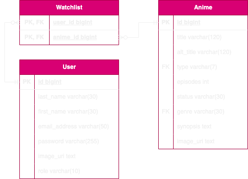
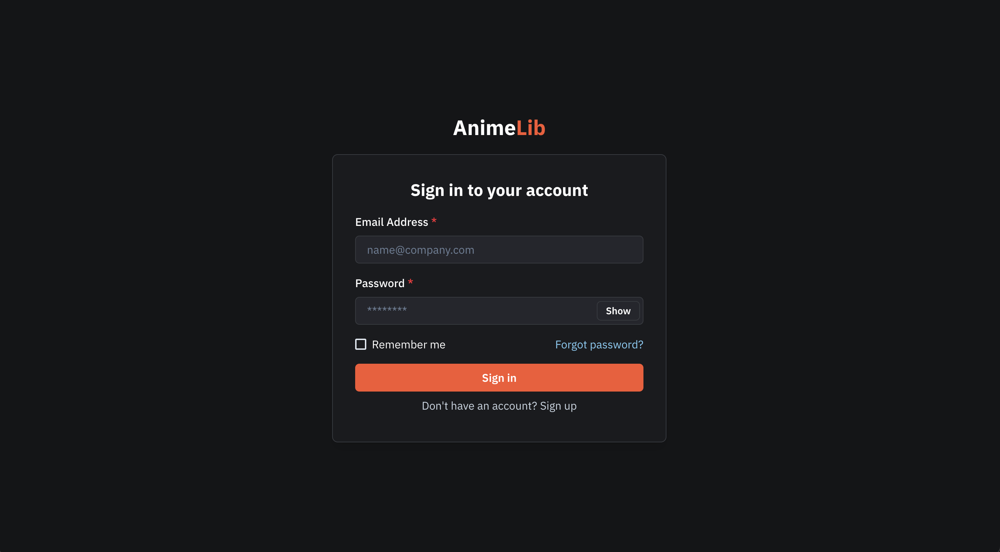
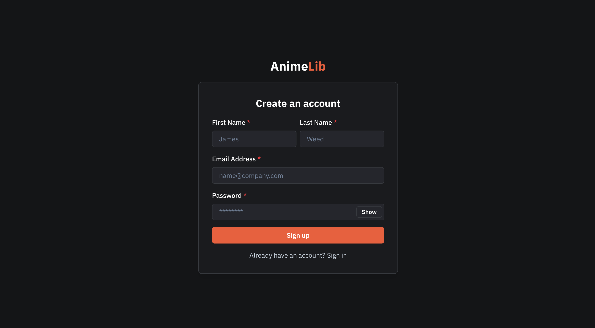
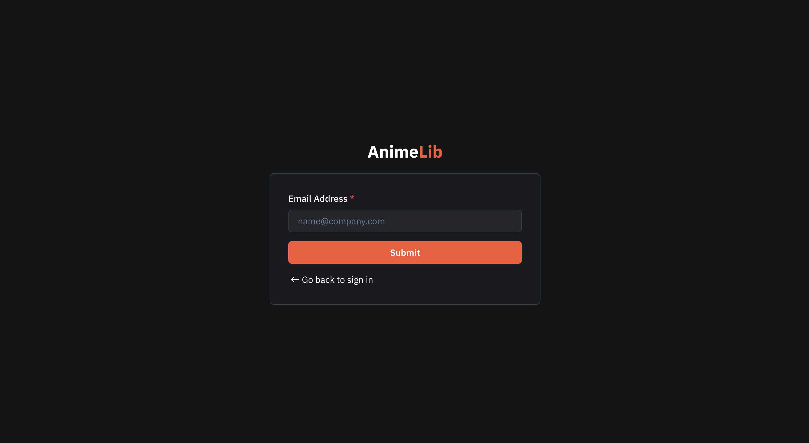
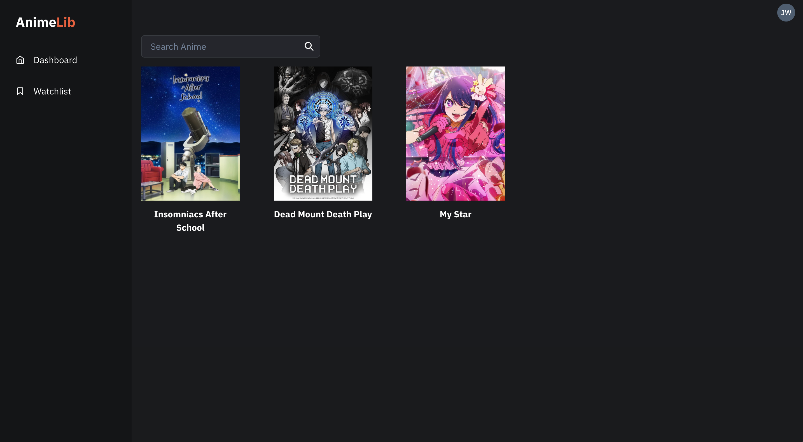
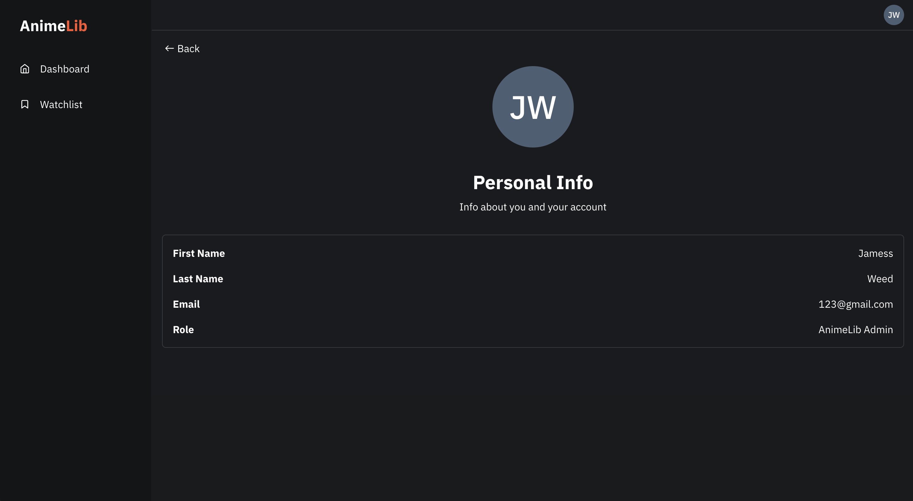

# AnimeLib: An Anime Catalogue

AnimeLib is an anime catalogue of people's favourite animes. Every user has a "Watchlist" where they can add animes they are interested.

This is a full-stack web application that aim to use the following technologies:

### Frontend
* [X] React.js
* [X] Vite.js
* [X] ChakraUI
* [X] Redux Toolkit (RTK)
* [X] RTK Query

### Backend
* [X] Spring Web
* [X] MyBatis Plus
* [X] MyBatisPlus Plus
* [X] Project Lombok
* [X] Knife4j
* [X] Apache Shiro
* [ ] JustAuth
* [ ] Redisson
* [ ] Quartz
* [ ] Hutool
* [ ] AutoPOI

#  Database Entity Relationship Diagram (ERD)


# Requirements

* [Docker 3.5](https://www.docker.com/)
* [NodeJS](https://nodejs.org/en)
* [Java 8](https://www.java.com/en/download/)
* Spring Boot 2.3.12

# Tools

* [IntelliJ IDEA Ultimate](https://www.jetbrains.com/idea/download/)
* [Visual Studio Code](https://code.visualstudio.com/download#)

# Getting Started
1. Install the requirements specified above.
2. Configure `MYSQL_ROOT_PASSWORD` in the `docker-compose.yml` file.
3. Run the following command in your IDE terminal:
```shell
docker compose-up
```
4. Run the `AnimeLib` container in Docker.
5. Access MySQL in the terminal and create the `animelib_db` database using this command:
```mysql
CREATE DATABASE animelib_db;
```
6. Run `AnimelibApplication.java` located in `backend/animelib/src/main/java/com/sunognaisda/animelib` to start the application's backend.
7. Open the terminal in your IDE.
8. Run this command to install the dependencies
```shell
npm install
```
9. Run this command to start the web application:
```shell
npm run dev
```
10. Go to `http://localhost:3000/` in your browser to access the web application.

# System Screenshots
### Sign in Page


### Sign up Page


### Forgot Password Page


### Dashboard (Admin)
.png)

### Dashboard (User)
.png)

### Watchlist


### Anime Information Page (Admin)
.png)

### Anime Information Page (User)
.png)

### User Profile Page


# Future Implementations
- Refactor
- Database Normalization
- Account Management
- Sorting
- Form Validation and Error Handling
- Fully Responsive Design
- Multiple Genres per Anime entry
- JustAuth
- Redisson
- Quartz
- Hutool
- AutoPOI

# References
- [Lazy loading in React | LoginRadius Blog](https://www.loginradius.com/blog/engineering/lazy-loading-in-react/)
- [Installing and Using Chakra UI with React | Pluralsight](https://www.pluralsight.com/guides/installing-and-using-chakra-ui-with-react)
- [React Fetch Data with Redux Toolkit RTK Query Tutorial](https://www.positronx.io/react-fetch-data-with-redux-toolkit-rtk-query-tutorial/)
- [Spring Boot 2.3.12 Reference Documentation](https://docs.spring.io/spring-boot/docs/2.3.12.RELEASE/reference/html/index.html)
- [MyBatis-Plus](https://baomidou.com/)
- [mybatisplus 复合主键(多主键) CRUD](https://blog.csdn.net/virtual_users/article/details/118151385)
- [MyBatisPlus-Plus](https://gitee.com/jeffreyning/mybatisplus-plus)
- [MyBatis和JPA的优劣以及MyBatis-Plus的使用](https://blog.csdn.net/qq_45735705/article/details/115988506)
- [Liquibase Documentation](https://docs.liquibase.com/home.html)
